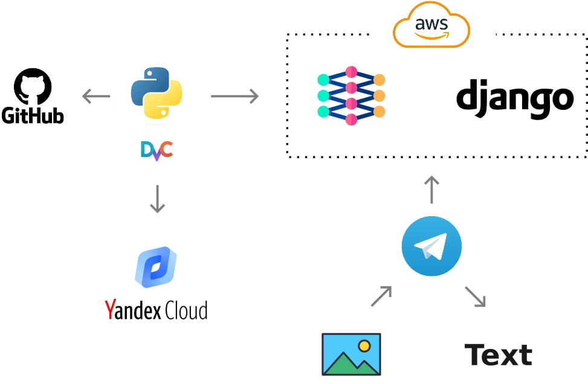

<h1>Movie Posters Captioning</h1>

Проект представляет собой развлекательный сервис по генерации подписей к фильмам посредством нейронной сети. Сеть обучена на кратком описании фильмов с сайта Кинопоиск. Поэтому по задумке сервис будет выдавать смешные подписи к фотографиям в стиле блокбастера.

Сервис разрабатывался в рамках ODS курса [ML System Design](https://ods.ai/tracks/ml-system-design-22), поток осень 22/23 года.

На момент разработки сервис развернут в виде телеграм-бота по адресу: https://t.me/MPC_project_bot

<h2>Участники</h2>

В разработке участвовали:
- https://github.com/dumperize (https://t.me/dumperize) - DS
- https://github.com/b-l-a-i-n (https://t.me/evgeennnn) - DS, backend
- https://github.com/slivka83 (https://t.me/slivka_83) - DS

<h2>Архитектура проекта</h2>

<h2>Структура проекта</h2>

- data - данные для обучения
  - external - датасеты с фильмам найденные в интернете
  - raw - ответ полученный на запрос с https://kinopoiskapiunofficial.tech
  - interim - обработанный ответ API и сохранный в виде датафрейма
  - processed - предобработанный текст (удалены служебные символы)
  - img - скаченные картинки
- models - сохраненные веса обученной модели
- notebooks - ноутбуки участников
- app - код бота
- src - исходный код
  - data - полный пайплайн формирования данных для обучения
  - models - код обучения модели и выполнения предсказания
- equirements.txt - библиотеки необходимые для воспроизведения результата
- dvc.yaml - конфиг для запуска пайплана загрузки данных

<h2>Воспроизведение</h2>

Чтобы заново обучить модель выполните слудующие шаги:
1. Загрузка описаний фильмов происходит с сайта Кинопоиск через API стороннего платного сервиса https://kinopoiskapiunofficial.tech. Поэтому сначала зарегестрируйтесь на https://kinopoiskapiunofficial.tech и оплатите платную подписку (на момент разработки проекта стоила 500р. бессрочно). Если возникунут проблемы свяжитесь с тех. поддержкой сервиса.
2. Клонируйте проект на локальный компьютер:
<pre>git clone https://github.com/slivka83/movie_posters_captioning.git</pre>
3. Создайте в корне проекта файл config_private.yml с таким содержимым:
<pre>X-API-KEY: 'X-API-KEY'</pre>
где X-API-KEY - ключ, который выполучили на сайте https://kinopoiskapiunofficial.tech

4. Установите все необходимы библиотеки:
<pre>pip install req</pre>
5. В консоли перейти в папку проекта и выполнить команду
make
она выполнит обработку и загрузку всех файлов